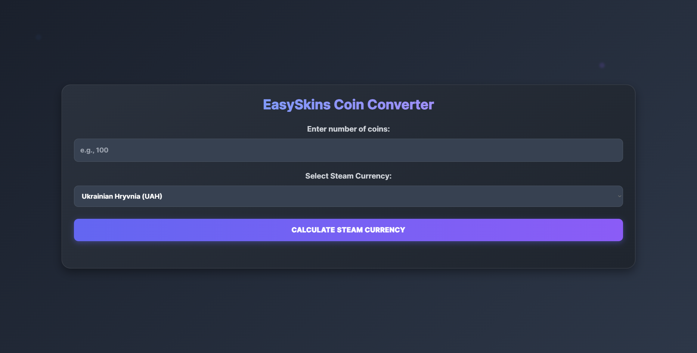

<div align="center">
  
  <h1>EasySkins Coin Converter 💰✨</h1>
  <p>
    A simple, stylish, and customizable web-based tool to instantly convert EasySkins coins into various Steam currencies.
  </p>
  <p>
    <a href="https://github.com/YOUR_USERNAME/YOUR_REPOSITORY_NAME/blob/main/LICENSE.md">
      
    </a>
    <!-- Add other badges if you have them, e.g., for build status, version -->
  </p>
</div>

---

<p align="center">
  <strong>
    <a href="YOUR_LIVE_DEMO_URL_HERE_OR_LINK_TO_INDEX_HTML_IN_REPO" target="_blank">
      🚀 Quick Launch / Try it Out! 🚀
    </a>
  </strong>
</p>
<p align="center">
  <em>(If you haven't deployed it, you can link directly to the <code>index.html</code> in your repository for users to download and open, or guide them to clone and open.)</em>
</p>

---

## 📸 Screenshot

<p align="center">
  
  <!--
    IMPORTANT:
    1. Create a folder named `images` (or similar) in your repository's root.
    2. Place your screenshot (e.g., `screenshot.png`) inside this `images` folder.
    3. Ensure the path `./images/screenshot.png` above is correct.
  -->
</p>

---

## 🌟 Core Features

*   💧 **Real-time Coin Conversion:** Instantly see the value of your coins in your selected Steam currency.
*   🌍 **Multi-Currency Support:** Choose from a list of common Steam currencies (UAH, USD, EUR, GBP, etc.) via a convenient dropdown menu.
*   🎨 **Interactive & Modern UI:** A visually appealing and responsive design with subtle animations.
*   🔧 **Customizable Conversion Rates:** Easily adjust coin-to-currency rates in the source code.
*   💬 **User-Friendly Messages:** Clear feedback for inputs, successful conversions, and errors.

---

## 🚀 How to Use

Getting started with the EasySkins Coin Converter is simple!

1.  **Launch the Application:**
    *   Click the **[🚀 Quick Launch / Try it Out! 🚀](#)** button above (if deployed).
    *   **OR** Clone/download this repository and open the `index.html` file in your preferred web browser.
2.  **Enter Coins:** In the intuitive input field, type the number of coins you wish to convert.
3.  **Select Currency:** Choose your desired Steam currency from the smart dropdown list.
4.  **Calculate:** Click the vibrant "Calculate Steam Currency" button.
5.  ✨ **View Result:** The equivalent amount in your chosen currency will magically appear!

---

## 🛠️ Customizing the Conversion Rates

The accuracy of this converter depends on its conversion rates. These are defined within the `CONVERSION_RATES` object in the JavaScript section of `index.html`.

> **⚠️ Important:** The rates provided in the `index.html` file are **illustrative examples only**. You **MUST** adjust them to accurately reflect the actual conversion rates from EasySkins coins to each specific Steam currency for the converter to be useful.

**Steps to Customize:**

1.  Open the `index.html` file in your favorite text editor.
2.  Locate the `CONVERSION_RATES` object within the `<script>` tags:

    ```javascript
    const CONVERSION_RATES = {
        'UAH': { rate: 0.43, symbol: '₴' }, // Example: 1 EasySkins Coin = 0.43 UAH
        'USD': { rate: 0.01, symbol: '$' },  // Example: 1 EasySkins Coin = 0.01 USD
        'EUR': { rate: 0.009, symbol: '€' }, // Example: 1 EasySkins Coin = 0.009 EUR
        // ... add or modify other currencies here!
        // 'GBP': { rate: 0.008, symbol: '£' },
    };
    ```

3.  **Modify the `rate` value for each currency.** This `rate` represents the value of **1 EasySkins coin** in that currency.
    *   For example, if 100 EasySkins coins equal 43 UAH, then 1 coin equals `0.43` UAH (`rate: 0.43`).
4.  **Add/Remove Currencies:** You can extend this object to include more currencies or remove ones you don't need. Just follow the existing format: `'CURRENCY_CODE': { rate: YOUR_RATE, symbol: 'CURRENCY_SYMBOL' }`.

---

## 🌐 Technologies Used

*   뼈 **HTML5:** The structural foundation.
*   🎨 **Tailwind CSS:** For rapid, utility-first, and responsive styling.
*   ⚙️ **JavaScript (Vanilla):** Powering all interactive functionality and calculations.

---

## 📝 License

This project is open source and available under the [MIT License](LICENSE.md).

Made by Pilixy :)

---

<p align="center">
  <em>Happy Converting! ✨</em>
</p>
